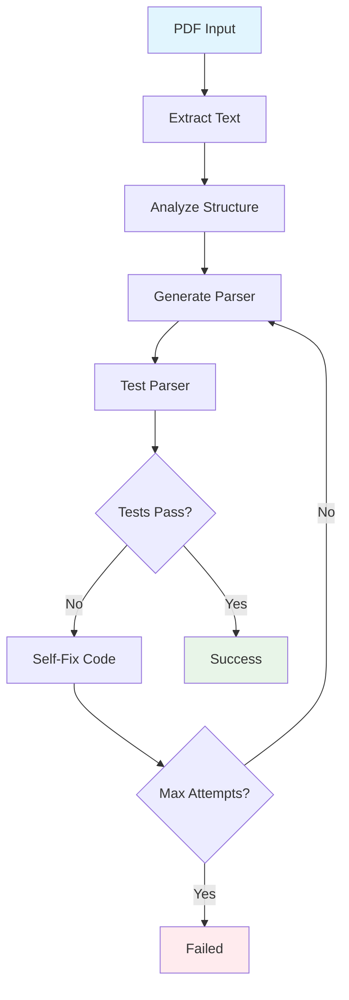

# PDF Parser Generation Agent 🤖

An intelligent agent that automatically generates custom parsers for bank statement PDFs using LangGraph and LLMs. The agent analyzes PDF structure, generates parsing code, tests it, and self-fixes errors to create robust parsers.

## 🚀 Features

- **Automated Parser Generation**: Creates custom parsers for any bank's PDF format
- **Self-Fixing Loop**: Automatically detects and fixes parsing errors (up to 3 attempts)
- **Multiple PDF Libraries**: Uses both `pdfplumber` and `PyPDF2` for maximum compatibility
- **Standardized Output**: All parsers return consistent DataFrame format
- **Comprehensive Testing**: Built-in validation against expected CSV outputs
- **CLI Interface**: Easy-to-use command-line interface

## 📁 Project Structure

```
ai-agent-challenge/
├── agent.py                    # Main agent implementation
├── custom_parsers/             # Generated parser modules
│   ├── __init__.py
│   └── icici_parser.py        # Example ICICI parser
├── test_parser.py             # Testing framework
├── data/                      # Sample data
│   ├── icici/
│   │   ├── icici_sample.pdf   # Sample ICICI statement
│   │   └── expected_output.csv # Expected parsing results
│   └── sbi/                   # Additional bank samples
├── requirements.txt           # Project dependencies
├── .env.example              # Environment variables template
└── README.md                 # This file
```

## 🛠️ Installation

### Prerequisites

- Python 3.8+
- OpenAI API key (or other LLM provider)

### Setup

1. **Clone the repository**
   ```bash
   git clone https://github.com/your-username/ai-agent-challenge.git
   cd ai-agent-challenge
   ```

2. **Install dependencies**
   ```bash
   pip install -r requirements.txt
   ```

3. **Set up environment variables**
   ```bash
   cp .env.example .env
   # Edit .env and add your OpenAI API key
   echo "OPENAI_API_KEY=your_api_key_here" > .env
   ```

## 🎯 Usage

### Core Task 1: Generate ICICI Parser

Generate a parser for ICICI bank statements:

```bash
python agent.py --target icici --pdf data/icici/icici_sample.pdf
```

### Core Task 2: CLI Usage

The agent supports flexible CLI usage for any bank:

```bash
python agent.py --target sbi --pdf data/sbi/sbi_sample.pdf
python agent.py --target hdfc --pdf data/hdfc/hdfc_sample.pdf --api-key your_key
```

### Core Task 3: Parser Contract

All generated parsers follow this contract:

```python
def parse(pdf_path: str) -> pd.DataFrame:
    """
    Parse bank statement PDF and return DataFrame with columns:
    - date: datetime
    - description: str  
    - debit: float
    - credit: float
    - balance: float
    """
```

### Core Task 4: Testing

Test any generated parser:

```bash
python test_parser.py custom_parsers/icici_parser.py data/icici/icici_sample.pdf --expected data/icici/expected_output.csv
```

### Core Task 5: Agent Workflow

The agent follows this 5-step process:

1. **Extract Text**: Reads PDF content using multiple libraries
2. **Analyze Structure**: Uses LLM to understand transaction patterns  
3. **Generate Code**: Creates parser code based on analysis
4. **Test Parser**: Validates generated code against sample data
5. **Self-Fix**: Iteratively improves code if tests fail (max 3 attempts)

## 🏗️ Agent Architecture



The agent uses **LangGraph** to orchestrate this workflow with proper state management and error handling.

## 📝 Example Usage

### Generate Parser for New Bank

```python
from agent import PDFParserAgent

# Initialize agent
agent = PDFParserAgent(openai_api_key="your-key")

# Generate parser
parser_file = agent.generate_parser(
    pdf_path="data/newbank/sample.pdf",
    target_bank="newbank"
)

# Test the generated parser
from test_parser import test_parser
test_parser(parser_file, "data/newbank/sample.pdf")
```

### Use Generated Parser

```python
from custom_parsers.icici_parser import parse

# Parse a statement
df = parse("path/to/icici_statement.pdf")

# Display results
print(f"Found {len(df)} transactions")
print(df.head())

# Calculate totals
total_debits = df['debit'].sum()
total_credits = df['credit'].sum()
print(f"Total debits: ₹{total_debits:,.2f}")
print(f"Total credits: ₹{total_credits:,.2f}")
```

## 🧪 Testing Framework

### Automated Testing

The testing framework validates parsers against expected outputs:

```bash
# Test with expected results
python test_parser.py custom_parsers/icici_parser.py data/icici/sample.pdf --expected data/icici/expected.csv

# Save parsed results
python test_parser.py custom_parsers/sbi_parser.py data/sbi/sample.pdf --output results.csv
```

### Test Results

The framework checks:
- ✅ Required columns present
- ✅ Data types correct
- ✅ Row count matches
- ✅ Numeric values within tolerance
- ⚠️ Minor description differences (warnings only)

## 🔧 Configuration

### Environment Variables

```bash
# Required
OPENAI_API_KEY=your_openai_api_key

# Optional - Alternative LLM providers
ANTHROPIC_API_KEY=your_claude_key
GOOGLE_API_KEY=your_gemini_key
```

### Agent Parameters

Customize agent behavior:

```python
agent = PDFParserAgent(
    openai_api_key="your-key",
    model="gpt-4",           # LLM model to use
    max_iterations=3,        # Max self-fix attempts
    temperature=0.1          # LLM temperature
)
```

## 📊 Output Format

All parsers return a standardized pandas DataFrame:

| Column | Type | Description |
|--------|------|-------------|
| `date` | datetime | Transaction date |
| `description` | str | Transaction description |
| `debit` | float | Debit amount (0 if credit) |
| `credit` | float | Credit amount (0 if debit) |
| `balance` | float | Account balance after transaction |

## 🚀 Advanced Usage

### Custom Parser Templates

Extend the base parser template:

```python
def create_custom_parser(bank_name: str, special_patterns: dict):
    """Create parser with bank-specific patterns"""
    # Implementation here
    pass
```

### Batch Processing

Process multiple PDFs:

```bash
for pdf in data/*/*.pdf; do
    bank=$(basename $(dirname $pdf))
    python agent.py --target $bank --pdf $pdf
done
```

### Integration

Integrate with existing systems:

```python
from agent import PDFParserAgent
from pathlib import Path

def process_bank_statements(folder_path: str):
    """Process all PDFs in a folder"""
    agent = PDFParserAgent()
    
    for pdf_file in Path(folder_path).glob("*.pdf"):
        bank_name = pdf_file.stem.split('_')[0]  # Extract bank from filename
        
        parser_file = agent.generate_parser(str(pdf_file), bank_name)
        
        if parser_file:
            # Use the generated parser
            import importlib.util
            spec = importlib.util.spec_from_file_location("parser", parser_file)
            parser = importlib.util.module_from_spec(spec)
            spec.loader.exec_module(parser)
            
            result = parser.parse(str(pdf_file))
            print(f"Processed {bank_name}: {len(result)} transactions")
```

## 🤝 Contributing

1. Fork the repository
2. Create a feature branch: `git checkout -b feature/new-feature`
3. Add tests for new functionality
4. Ensure all tests pass: `python -m pytest`
5. Submit a pull request

## 📄 License

This project is licensed under the MIT License - see the LICENSE file for details.

## 🆘 Troubleshooting

### Common Issues

**1. PDF Reading Errors**
```bash
Error: Failed to extract text from PDF
```
- Ensure PDF is not password-protected
- Try different PDF libraries in the agent
- Check if PDF contains searchable text

**2. Parser Generation Fails**
```bash
Error: Failed to generate working parser
```
- Check your OpenAI API key
- Ensure sufficient API credits
- Try with a clearer, more structured PDF sample

**3. Import Errors**
```bash
ImportError: No module named 'langchain'
```
- Reinstall dependencies: `pip install -r requirements.txt`
- Check Python version (3.8+ required)

### Debug Mode

Enable verbose logging:

```python
import logging
logging.basicConfig(level=logging.DEBUG)

agent = PDFParserAgent()
agent.generate_parser("sample.pdf", "testbank")
```

## 📞 Support

- 📧 Email: support@example.com
- 🐛 Issues: [GitHub Issues](https://github.com/your-username/ai-agent-challenge/issues)
- 📖 Documentation: [Wiki](https://github.com/your-username/ai-agent-challenge/wiki)

---

**Built with ❤️ using LangGraph, OpenAI, and Python**