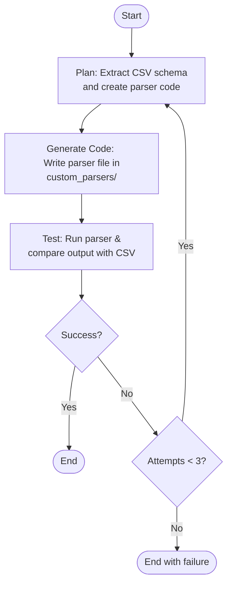

# Karbon Agent-as-Coder Challenge

## Overview

This project implements an autonomous coding agent (`agent.py`) that generates custom Python parsers for bank statement PDFs.  
When run, the agent:
1. Reads a sample PDF statement and matching CSV.
2. Generates a parser that implements the contract `parse(pdf_path) -> pd.DataFrame`.
3. Automatically writes the parser file into `custom_parsers/`.
4. Tests the parser’s output against the reference CSV.
5. Retries up to 3 times if mismatches are found, until the parser passes.

---

## How to Run (5 Steps)

1. **Install dependencies from requirements.txt**  
```
pip install pandas pdfplumber pytest
```

2. **Prepare data**  
Ensure that bank statement PDF and matching CSV are present:
```
data/icici/icici_sample.pdf
data/icici/result.csv
```

3. **Run the agent**  
```
python agent.py --target icici
```

4. **Check generated parser**  
After running, a working parser will be created:
```
custom_parsers/icici_parser.py
```

5. **Run automated tests**  
```
pytest tests/
```

All tests should pass if the parser correctly matches the CSV.

---

## Agent Architecture and Diagram

- The agent operates in a loop: **Plan → Generate Code → Test → Self‑Fix**, using the CSV to determine the exact column schema.  
- It then writes a new parser that uses `pdfplumber` to parse the PDF tables, cleans the extracted data, and aligns it with the reference CSV’s schema and typing.  
- If tests fail, the agent retries, regenerating and adjusting the parser up to 3 times. 

This design allows adding new banks by simply supplying a new sample PDF and CSV, without manual parser edits.



---

## Requirements

- Python 3.8+
- pandas
- pdfplumber
- pytest


