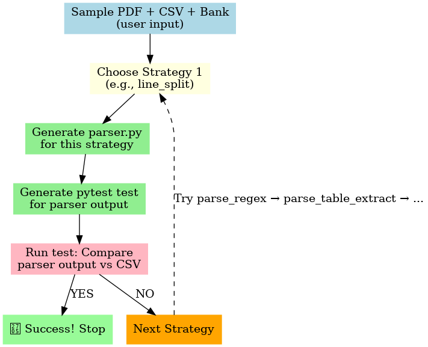

# ai-agent-challenge
Coding agent challenge which write custom parsers for Bank statement PDF.
---

# Karbon AI Agent Challenge — Bank Statement Parser

This project is an **auto-coding AI agent** that, given a sample PDF bank statement and its expected CSV output,  
automatically writes a working parser, tests it, and retries with new strategies until it succeeds.

---
## How the Agent Loop Works

When you run the agent, it will try up to **three parsing strategies** in sequence:

1. **`parse_line_split`** – Splits PDF text into lines and parses each line.
2. **`parse_regex`** – Uses regular expressions to extract fields.
3. **`parse_table_extract`** – Extracts tables directly from the PDF.

### Flow Diagram


---
1. **Install dependencies**
```bash
python -m venv venv
venv\Scripts\activate       # Windows: 
pip install -r requirements.txt
```

2. **Place your sample data**
```bash
data/<bank_name>/<bank_name>_sample.pdf
data/<bank_name>/<bank_name>_sample.csv
```
### Example for ICICI:
```bash
data/icici/icici_sample.pdf
data/icici/icici_sample.csv

```
3. **Run the agent**
```bash
python agent.py --target icici --pdf data/icici/icici_sample.pdf --csv data/icici/icici_sample.csv
```
4. **Verify results we can re-run tests manually**
```bash 
pytest tests/test_icici.py
```